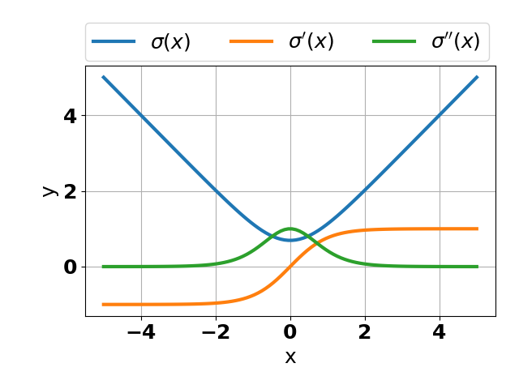
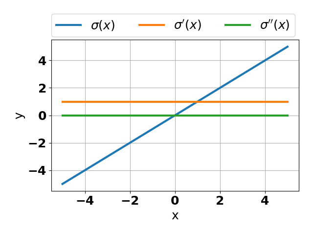
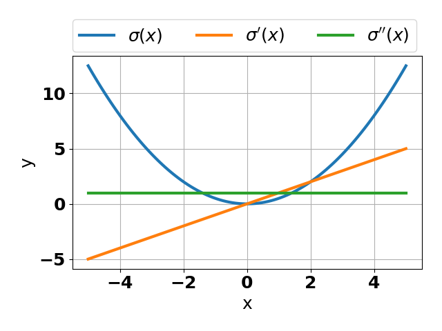
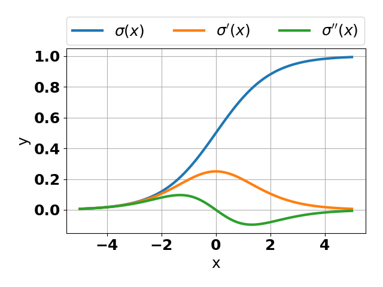
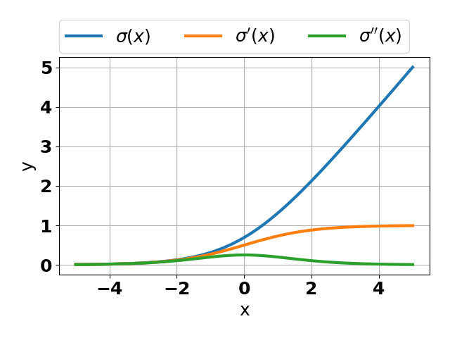
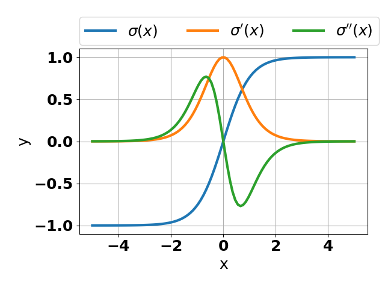

hessQuik.activations
=====================

hessQuik Activation Function
----------------------------

.. automodule:: hessQuik.activations.hessQuik_activation_function
   :members:
   :show-inheritance:

AntiTanh
--------

.. automodule:: hessQuik.activations.antiTanh_activation
   :members:
   :show-inheritance:

Identity
--------

.. automodule:: hessQuik.activations.identity_activation
   :members:
   :show-inheritance:

Quadratic
---------

.. automodule:: hessQuik.activations.quadratic_activation
   :members:
   :show-inheritance:

Sigmoid
-------

.. automodule:: hessQuik.activations.sigmoid_activation
   :members:
   :show-inheritance:

Softplus
--------

.. automodule:: hessQuik.activations.softplus_activation
   :members:
   :show-inheritance:

Tanh
----

.. automodule:: hessQuik.activations.tanh_activation
   :members:
   :show-inheritance:

