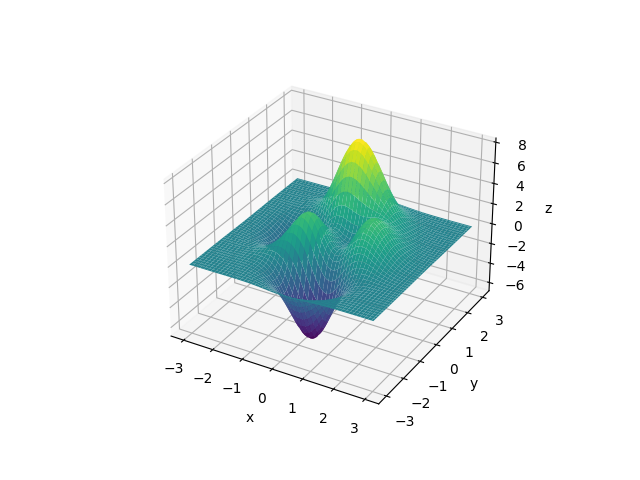

hessQuik.utils
==============

Peaks Data
----------

.. automodule:: hessQuik.utils.data
   :members:

Input Derivative Checks
-----------------------

.. automodule:: hessQuik.utils.input_derivative_check
   :members:

Network Weights Derivative Check
--------------------------------

.. automodule:: hessQuik.utils.network_derivative_check
   :members:

Timing Functions
----------------

.. automodule:: hessQuik.utils.timing
   :members:

Training Functions
------------------

.. automodule:: hessQuik.utils.training
   :members:

Additional Utilities
--------------------

.. automodule:: hessQuik.utils.utils
   :members:

